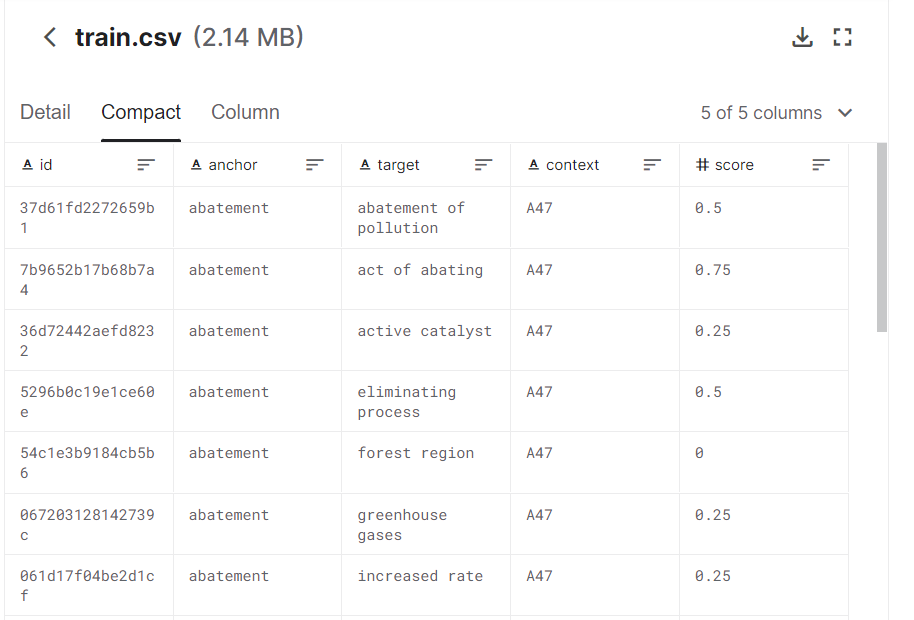

# uspppm_competition
Решения команды ChebaChill на соревновании U.S. Patent Phrase to Phrase Matching

# Соревнование
Его можно найти по следующей [ссылке](https://www.kaggle.com/competitions/us-patent-phrase-to-phrase-matching).

# ensemble

Основная идея модели - **ансамбль из BERT-подобных моделей**, улучшение [этого ноутбука](https://www.kaggle.com/code/diamondlee/u-s-pppm-simple-ensemble-baseline).

## Использованные в ансабле модели

* deberta_v3_large;

* electra_base_discriminator;

* [BERT, предобученный на патентах](https://huggingface.co/anferico/bert-for-patents);

Код для обучения каждой из моделей прилагается :)

## О `train`e для моделей

Данные выглядят так: 

Есть слово `anchor`, с которым сравнивается слово `target` в *контексте* `context`, мера схожести - `score`.

`context` в данном случае лишь метка категории контекста, благодаря сообществу удалось найти [полное текствое описание оных](https://www.kaggle.com/datasets/xhlulu/cpc-codes).

Таким образом, на вход моделям подавалось:

* `inputs` - `anchor` + `[SEP]`(специальный-токен разделитель для BERTовых моделей) + полное описание контекста для сравнения;

* `targets` - `target`;

* `labels` - `score`.

Предложенный `train` был поделен на 5 частей при помощи `StratifiedKFold` [следующим образом](https://www.kaggle.com/code/abhishek/phrase-matching-folds).

## Fine-tuning моделей

По сути, каждая из архитектур обучалась 5 раз - трейном для них служили 4 части исходного трейна, а оставшийся фолд был валидирующим.

Непосредственно до обучения подбирались lr и настройки lr_scheduler'а при помощи библиотеки `ray tune`: запускается `n_trials` (брал равным 5) конфигураций, с разными значениями сидов для планировщика, начальными значениями lr на малом количестве эпох. Затем лучшая из всех моделей дообучается на бОльшем количестве эпох (от 5 до 10 финальных эпох обучения).

Затем каждая из 5 моделей одной архитектуры сохранялась локально, впоследствии выгружалась на Kaggle.

## Inference

Как и говорилось ранее, финальная модель - ансамбль, который агрегировал предсказания 15 моделей.

Первоначально, каждый блок из 5 моделей одной архитектур (`deberta_v3_large`, `electra_base_discriminator`, `bert_for_patents`) выдавал предсказания усреднением предсказаний входящих моделей.

Затем 3 пачки предсказаний масштабировались при помощи `MinMaxScaler` - исходя из [этого обсуждения](https://www.kaggle.com/code/jellyz9/tips-for-ensambling), это может быть полезно для дальнейшего усреднения.

В конце концов, финальное предсказание считается так:

```python
final_predictions = 0.6 * scaled_deberta_predictions + 0.2 * scaled_electra_predictions + 0.2 * scaled_bert_patent_predictions
```

Высокий вес на предсказания `deberta_v3_large` обуславливается изначально неплохим скором данной модели для данного соревнования.

Код для создания submission'а также прилагается.
